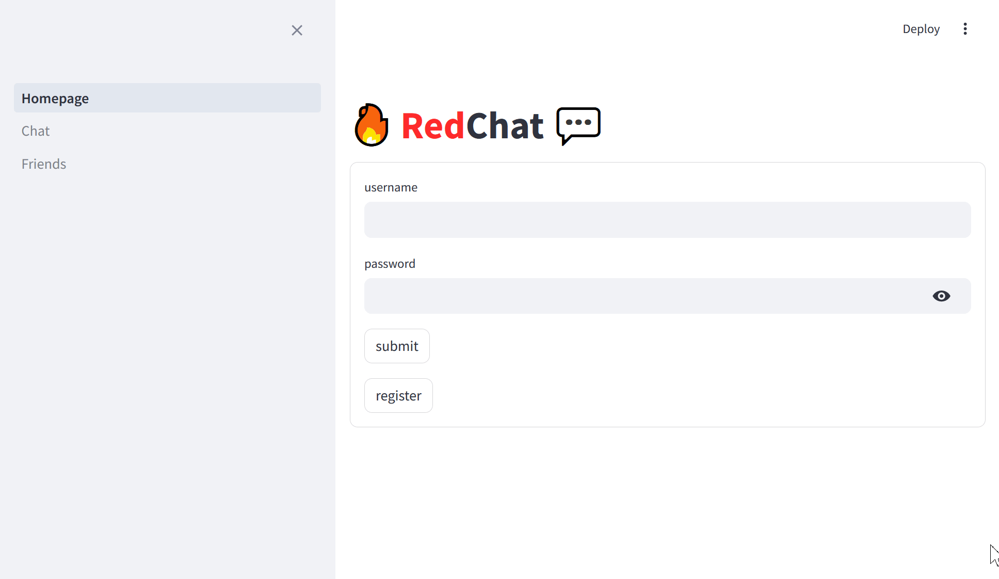
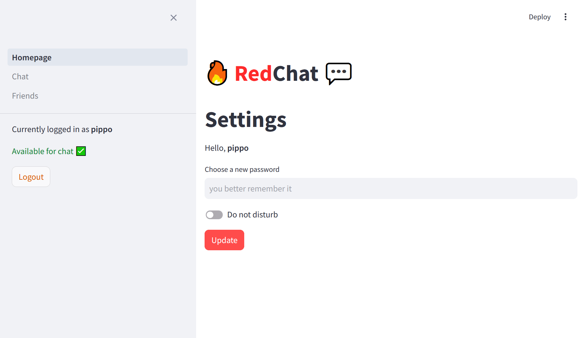
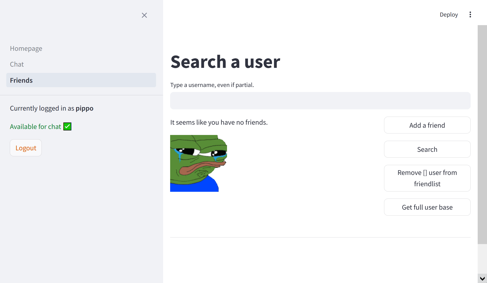
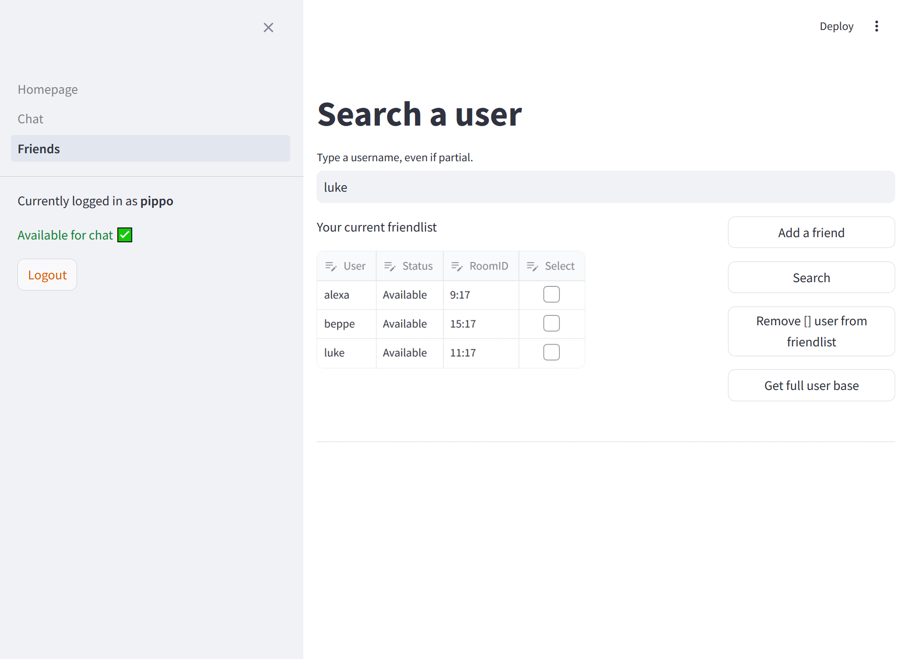
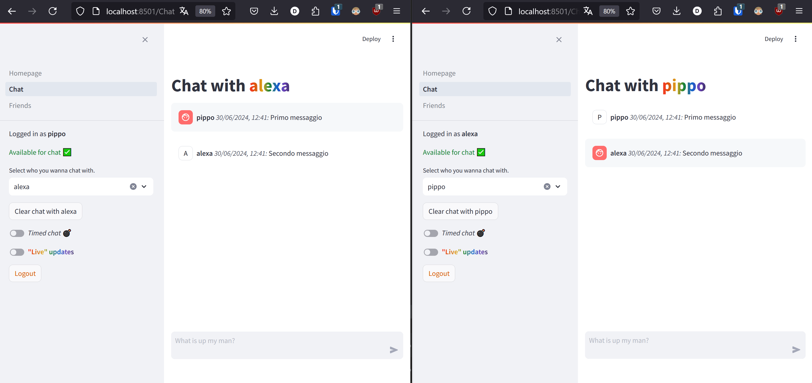

# Streamlit Interface README

1. [Framework utilizzato](#framework-utilizzato)
2. [Come far partire l’interfaccia](#come-far-partire-l’interfaccia)
3. [Autenticazione](#autenticazione)
5. [Gestione lista amici](#gestione-lista-amici)
6. [Chat Page](#chat-page)
7. [Limitazioni di Streamlit, PubSub](#limitazioni-di-streamlit,-pubsub)
8. [Redis Schema](#redis-schema)

## Framework utilizzato

Per realizzare l’interfaccia grafica ho deciso di utilizzare [Streamlit](https://streamlit.io/).

Streamlit è molto utilizzato nella data science per la sua velocità nel creare siti web utilizzando esclusivamente codice Python.

Personalmente mi piace utilizzarlo perchè velocizza significativamente il processo di sviluppo: quando modifichi un codice Python i cambiamenti vengono visualizzati in tempo reale sulla web interface di Streamlit. Questo mi permette di iterare molto piu’ velocemente.

Inoltre [ha dei widget per chattare con le LLM](https://docs.streamlit.io/develop/tutorials/llms/build-conversational-apps), che ho pensato potessero tornare utili per creare una chat con altri utenti.

Detto ciò, Streamlit ha delle limitazioni di cui parlerò in seguito.

## Come far partire l’interfaccia

Far partire l’interfaccia è molto semplice.

Basta installare le librerie presenti nei requirements (ovvero Redis e Streamlit)
```python
pip install streamlit
pip install redis-py
```
e inizializzare la web interface con:

```python
streamlit run Homepage.py
```

è inoltre possibile fruire della chat attraverso [redischat.streamlit.app](http://redischat.streamlit.app) . Sconsiglio di chattare in tempo reale da lì. 

L’intera interfaccia di Streamlit è contenuta in 3 files:

- [Homepage.py](http://Homepage.py)
- pages/Chat.py
- pages/Friends.py

## Autenticazione

La prima pagina del sito è la “Homepage”, che inizialmente permette di loggare o registrarsi.

Restituisce messaggi di errore se le credenziali sono errate, messaggi di successo se sono corrette. 



Una volta connessi la Homepage cambia aspetto:

Diventa una pagina nella quale è possibile cambiare la password ed impostare il Do Not Disturb.

Il Do Not Disturb viene impostato automaticamente su “Disponibile” una volta loggati. 

La sidebar presenta il tuo stato (Disponibile, Do not disturb) e c’è un pulsante per sloggare.

**Se si effettua un refresh (f5) della pagina si resetta la sessione di Streamlit e bisogna riloggare. è possibile loggare con piu’ utenti aprendo piu’ pagine dell’interfaccia.** 



## Gestione lista amici

La lista amici viene gestita dalla pagina Friends.py

è possibile:

- Cercare utenti attraverso la ricerca parziale 
- Visualizzare lo status dei propri amici e rimuoverli dalla lista in gruppo 
- Ottenere l’intera user base 
- Aggiungere un amico se viene inserito l’username corretto 



## Chat Page

Dalla Chat Page è possibile chattare con gli amici nella tua lista amici. 

Se non hai amici un messaggio ti incita ad aggiungerne. 

Una volta selezionato un amico viene caricata l’intera chat, che è possibile cancellare attraverso il pulsante “Clear Chat” [gif]

è inoltre possibile passare alle Timed Chats con l’utente selezionato. Le Timed Chats hanno un expire di 60 secondi dall’ultimo messaggio inviato.



## Limitazioni di Streamlit, PubSub

Tentando di implementare il Pub/Sub ho scoperto che Streamlit non supporta il multithreading. 

Quindi non è possibile inizializzare un thread che permetta ad un oggetto PubSub di “ascoltare” i nuovi messaggi dal database Redis. 

Quindi dovevo trovare un modo per sfruttare il PubSub utilizzando un singolo Thread. 

Inizialmente ho pensato all’async/io di Python. Ma non sapendo come funziona e non avendo tempo di impararlo ho realizzato qualcosa di molto piu’ semplice:

- Una volta selezionato un amico vengono caricati i messaggi.
- Se l’utente invia un messaggio i messaggi vengono “ricaricati”.
    - questo effettua un rerun dei widget di streamlit, che non è un refresh della pagina
- Attraverso il toggle “Live updates” viene inizializzato un ciclo while che ogni x secondi effettua un getMessage(). Se sono presenti nuovi messaggi li fa comparire sullo schermo.

I nuovi messaggi vengono visualizzati con un effetto “stream” stile chatGPT.



## Redis Schema

L’interfaccia grafica condivide la user base con l’interfaccia testuale. Le room, gli status del Do Not Disturb e le Friendlist non sono condivise e le strutture dati utilizzati presentano uno schema leggermente diverso. La logica delle rooms è la stessa. 

---

User username and password

- [*string*] **user:username** = password (hashata, meglio non indagare come)

---

UserID

- è un numero univoco assegnato ad ogni utente
- [*string*] **id_user:username** = userID

---

Do not disturb

- [*string*] **st:dnd:user:username** = ‘1’ or ‘0’

---

Users Friendlist

- [*hash*] **st:friendList:username** = { nomeAmico1 : roomID1, nomeAmico2 : roomID2 …}

---

Rooms 

- Le room per chattare hanno un id univoco composto dagli userID dei due utenti, ordinati dal piu’ piccolo al piu’ grande e separati da ‘ : ’ . Vengono salvati nella friendList.
    - Se pippo (id_user = 2) aggiungerà paperino (id_user = 1) allora i due chatteranno in una room che come id ha 1:2. L’id di questa room verrà salvata nella friendlist di Pippo come { ‘paperino’ = ‘1:2’ }
        - Le chat a tempo seguono la stessa logica ma hanno un asterisco prima dell’ID (*1:2)
- [*zset*] **st:room:userID_1:userID_2** = [ 'messaggio1':timestamp1, 'messaggio2':timestamp2 ...]
- Le chat sono degli zset dove lo score di ogni messaggio è un timestamp. Da quel timestamp viene ricostruita la data e l'ora nella chat.
